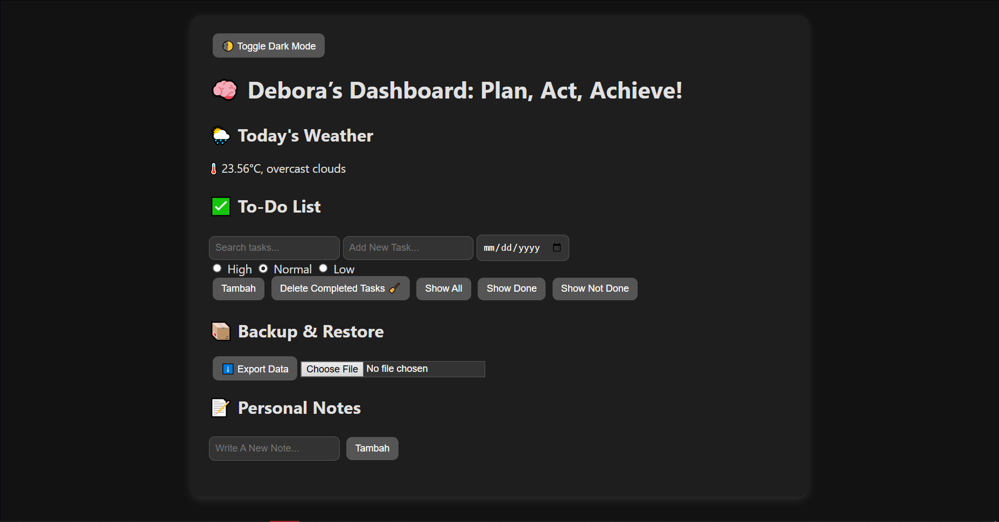

# 📋 MyLifeBoard - Personal Dashboard Web App

## 🚀 Penjelasan Singkat Aplikasi

**MyLifeBoard** adalah aplikasi dashboard pribadi berbasis web yang dirancang untuk membantu pengguna mengatur aktivitas sehari-hari. Aplikasi ini memadukan fitur **daftar tugas**, **catatan pribadi**, dan **cuaca real-time** dalam satu antarmuka yang menarik dan interaktif.

Tujuan utama aplikasi ini adalah memberikan pengguna pengalaman yang nyaman dalam mencatat, mengelola waktu, dan memantau informasi penting secara efisien, dengan tetap memperhatikan estetika dan kemudahan penggunaan.

## 🖼️ Screenshot Aplikasi

## ✅ Daftar Fitur Utama

- 📋 **Daftar Tugas** dengan kemampuan:
  - Tambah/hapus/edit tugas
  - Tandai tugas sebagai selesai
  - Urutkan tugas berdasarkan status
  - Filter tugas aktif dan selesai
  - Tombol hapus tugas yang sudah selesai
  - Notifikasi pengingat tugas

- 📝 **Catatan Pribadi** dengan fitur:
  - Tambah catatan dengan warna khusus
  - Edit dan hapus catatan
  - Pin catatan penting
  - Pencarian & filter catatan

- 🌤️ **Cuaca Real-Time** berdasarkan lokasi
- 🌓 **Mode Gelap/Terang** (dark/light mode toggle)
- 📅 **Integrasi Kalender & Pengingat Tenggat**
- 💾 **Penyimpanan Otomatis** menggunakan `localStorage`
- ⬆️⬇️ **Ekspor dan Impor Data**

## 🧠 Fitur ES6+ yang Diimplementasikan

Aplikasi ini menggunakan fitur modern dari JavaScript (ES6+) untuk efisiensi dan performa yang lebih baik, antara lain:

-  `let` dan `const` untuk deklarasi variabel
-  **Arrow Functions** (`=>`) untuk fungsi pendek dan kontekstual
-  **Template Literals** (`` `Hello, ${name}` ``) untuk string dinamis
-  **Destructuring Assignment** untuk mengambil nilai dari objek/array
-  **Default Parameters** pada fungsi
-  **Spread & Rest Operator** (`...`) untuk manipulasi array dan objek
-  **Modules (ES Modules)** untuk struktur kode terpisah dan terorganisir
-  **Promises & Async/Await** untuk pengambilan data (cuaca) secara asynchronous
-  **Class-based Structure** untuk fitur catatan dan tugas
-  **Optional Chaining (`?.`)** untuk keamanan saat akses properti nested